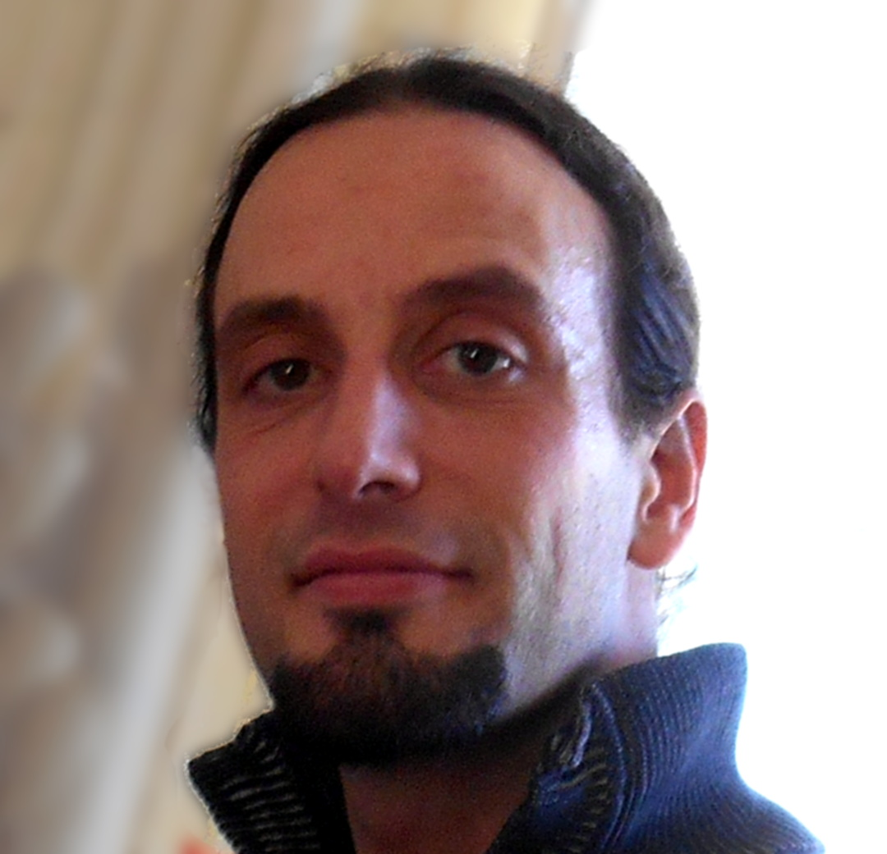

.. MACROS
   ...............................

.. |cleaner_h30| raw:: html

   

.. |box_start| raw::  html

   

   

.. |box_end| raw::  html

   <a class="gototop" href="#top">Go to Top</a>
   

   

   

.. |h2_start| raw::  html

   <h2>

.. |h2_end| raw::  html

   </h2>

.. |h3_start| raw::  html

   <h3>

.. |h3_end| raw::  html

   </h3>

..................................

|box_start|

|cleaner_h30|

.. raw:: html

  

.. raw:: html

   <iframe width="51" height="24" src="http://corrupt.ch/fartbutton/plugin" frameborder="0"></iframe>
  

| **Anthony Scemama**                             
| *Ingénieur de Recherche CNRS*                   
| Laboratoire de Chimie et Physique Quantiques    
| IRSAMC, Université Paul Sabatier Toulouse III   
| 118, route de Narbonne                          
| 31062 Toulouse Cedex 4                          
| scemama@irsamc.ups-tlse.fr               
| ORCID : 0000-0003-4955-7136
| `@scemama666 <http://twitter.com/scemama666>`__
| `GitHub profile <https://github.com/scemama>`__
| `GitLab profile <https://gitlab.com/scemama>`__
| `ResearchGate profile <https://www.researchgate.net/profile/Anthony_Scemama>`__

.. raw:: html

   

|cleaner_h30|

|box_end|

.. _software:

|box_start|

|h2_start| Main Software |h2_end|
  
`Quantum Package <https://quantumpackage.github.io/qp2>`__
  A programming environment for wave function methods.

`QMC=Chem <http://qmcchem.ups-tlse.fr>`__
  Massively parallel general Quantum Monte Carlo code

`IRPF90 <http://irpf90.ups-tlse.fr>`__
   Fortran pre-processor helping the development of large scientific codes in Fortran

`EZFIO <http://gitlab.com/scemama/EZFIO>`__
  The Easy Fortran I/O library generator

`F77_ZMQ <http://github.com/scemama/f77_zmq>`__
  A Fortran77 binding for the ZeroMQ communication library.

  
|h3_start| Contributions in |h3_end|
  
`Q5Cost <http://q5cost.org>`__
  Library for a common file format for Quantum Chemistry
  
`deMon Nano <http://demon-nano.ups-tlse.fr>`__
  DFTB branch of deMon
  
|h3_start| Useful tools |h3_end|

`Slater-Condon rules <https://gitlab.com/scemama/slater_condon>`__
  Computes Slater-Condon rules using SSE4.2 and popcnt for determinant-driven calculations

`Multiuser <https://gitlab.com/scemama/multiuser>`__
  Allow multiple users to share the same linux account (for demos, and classes)

`Gists <https://gist.github.com/scemama>`__
  Useful bits of code

|box_end|

.. _talks:

|box_start|

|h2_start| Oral presentations |h2_end|
  
#. | `Development in wave function methods made easy with IRPF90 and the Quantum Package <http://irpf90.ups-tlse.fr/files/winter_school2019.pdf>`__
#. | `Chimie quantique vs machines parallèles <http://irpf90.ups-tlse.fr/files/scemama_rctf_2018.pdf>`__
   | 11/10/2018 RCTF, Toulouse
#. | `QMC=Chem : Vectorisation efficace sur processeurs scalaires <http://irpf90.ups-tlse.fr/files/vecto_calmip2017.pdf>`__
   | 21/09/2017 CALMIP, Toulouse
#. | `QMC with large trial wave functions <http://irpf90.ups-tlse.fr/files/telluride2017.pdf>`__
   | 19/07/2017 TSRC, Telluride, USA
#. | `IRPF90: A Fortran code generator for HPC <http://irpf90.ups-tlse.fr/files/argonne_irpf90.pdf>`__
   | 13/07/2017 ALCF, Argonne, USA
#. | `Accelerated MR-PT2 with a Hybrid Stochastic/Deterministic Algorithm <http://irpf90.ups-tlse.fr/files/cecam_2017.pdf>`__
   | 22/05/2017 CECAM Theoretical Chemistry for Extended Systems, Toulouse
#. | `Accelerated MR-PT2 with a Hybrid Stochastic/Deterministic Algorithm <http://irpf90.ups-tlse.fr/files/cecam_2017.pdf>`__
   | 22/05/2017 CECAM Theoretical Chemistry for Extended Systems, Toulouse
#. | `Development in wave function methods made easy with IRPF90 and the Quantum Package <http://irpf90.ups-tlse.fr/files/nancy2016.pdf>`__
   | 23/03/2016 SRSMC, Nancy
#. | `QMC with very large multideterminant expansions <http://irpf90.ups-tlse.fr/files/pacifichem.pdf>`__
   | 18/12/2015 Pacifichem QMC symposium, Honolulu
#. | `Chimie quantique et parallélisme massif <http://irpf90.ups-tlse.fr/files/toucam2015.pdf>`__
   | 6/11/2015 Réunion TouCAM, Toulouse
#. | `Retour sur le cloud Challenge France Grilles <http://irpf90.ups-tlse.fr/files/succes2015.pdf>`__
   | 5/11/2015 Journées SUCCES, Paris `Watch video <http://webcast.in2p3.fr/videos-utilisation_hpc_en_chimie_quantique>`__
#. | `ZeroMQ for massively parallel codes <http://irpf90.ups-tlse.fr/files/oslo_zmq.pdf>`__
   | 8/10/2015 Centre for Theoretical and Computational Chemistry, Oslo
#. | `IRPF90 : a Fortran code generator for HPC <http://irpf90.ups-tlse.fr/files/oslo_irpf90.pdf>`__
   | 7/10/2015 Centre for Theoretical and Computational Chemistry, Oslo
#. | `A convenient solution to the multiple parentage problem: test of a MRCC method and prospects <http://irpf90.ups-tlse.fr/files/gdr_2015.pdf>`__
   | 8/7/2015 Reunion du GDR Correl, Marseille
#. | `Quantum chemistry in the Cloud <http://devlog.cnrs.fr/_media/jdev2015/jdev2015_t5_anthonyscemama_francegrilles_20150702.pdf>`__
   | 2/7/2015 JDev 2015, Bordeaux `Watch video <https://webcast.in2p3.fr/videos-retour_dexperience_sur_lutilisation_de_services_francegrilles_projet_challenge_fg>`__
#. | `IRPF90 : a Fortran code generator for HPC <http://devlog.cnrs.fr/_media/jdev2015/jdev2015_t8_anthonyscemama_irpf90_20150702.pdf>`__
   | 2/7/2015 JDev 2015, Bordeaux `Watch video <https://webcast.in2p3.fr/videos-irpf90>`__
#. | `Chimie quantique et parallélisme massif <http://irpf90.ups-tlse.fr/files/cecam2015.pdf>`__
   | 13/3/2015 discussion meeting CECAM-Fr-IdF "Développement de codes de chimie théorique dans un environnement HPC", Orsay
#. | `IRPF90 : a Fortran code generator for HPC <http://irpf90.ups-tlse.fr/files/hpckp2015.pdf>`__
   | 3/2/2015 HPC Knowledge Portal meeting, Barcelona `Watch video <https://youtu.be/TpMXkBlePSE>`__
#. | `IRPF90 : a Fortran code generator for HPC <http://irpf90.ups-tlse.fr/files/pyconf_2014.pdf>`__
   | 25/10/2014 Conférence Python PyConFr, Lyon `Watch video <http://www.infoq.com/fr/presentations/irpf90-fortran-code-generator-hpc>`__
#. | `Un algorithme permettant de traiter plus d’un million d’atomes en chimie quantique <http://irpf90.ups-tlse.fr/files/reims2014.pdf>`__
   | 30/9/2014 Maison de la simulation de l'Université de Reims Champagne-Ardenne
#. | `Millions of atoms in DFTB <http://irpf90.ups-tlse.fr/files/cecam_lausanne.pdf>`__
   | 23/1/2014 CECAM Workshop on two-dimensional inorganic materials, EPFL, Lausanne (Switzerland)
#. | `Un million d'atomes en chimie quantique <http://irpf90.ups-tlse.fr/files/mesochallenge2013.pdf>`__
   | 20/9/2013 Journée Mésochallenges Equip@Meso, IHP, Paris
#. | `A fast Sparse SCF implementation: Application to DFTB <http://irpf90.ups-tlse.fr/files/deMon2013.pdf>`__
   | 25/6/2013 CECAM deMon Workshop, LCC, Toulouse
#. | `Software optimization for petaflops/s scale Quantum Monte Carlo simulations <http://irpf90.ups-tlse.fr/files/mds.pdf>`__
   | 4/12/2012 Maison de la simulation, Saclay
#. | `Implémentation de simulations QMC  massivement parallèles pourla chimie: Du laboratoire aux calculateurs pétaflopiques en passant par les mésocentres <http://irpf90.ups-tlse.fr/files/equipatmeso.pdf>`__
   | 18/10/2012 Journée scientifique Equip@Meso, Strasbourg, `Watch video <http://canalc2.u-strasbg.fr/video.asp?idvideo=11473>`__
#. | `QMC=Chem: a quantum Monte Carlo program for large-scale simulations in chemistry at the petascale level and beyond <http://irpf90.ups-tlse.fr/files/kobe_talk.pdf>`__
   | 18/07/2012  10th International Meeting on High-Performance Computing for Computational Science (VECPAR 2012), Kobe (Japan)
#. | `Quantum Monte Carlo simulations in chemistry at the petascale level and beyond <http://irpf90.ups-tlse.fr/files/teratec.pdf>`__
   | 28/06/2012 Forum Teratec, Ecole Polytechnique, Palaisau
#. | `Quantum Monte Carlo simulations for Alzheimer’s disease on the Curie machine : Efficient strategies for extreme parallelism onpetascale platforms and beyond <http://irpf90.ups-tlse.fr/files/isc.pdf>`__
   | 19/06/2012 International Supercomputing Conference, Intel Theater, Hamburg (Germany)
#. | `Interprétation des liaisons chimiques à partir de fonctions d'ondes de grande précision <http://irpf90.ups-tlse.fr/files/lcc_2012.pdf>`__
   | 15/06/2012 Laboratoire de Chimie de Coordination, Toulouse
#. | `Gestion de clusters de calcul avec Rocks <http://irpf90.ups-tlse.fr/files/rocks.pdf>`__
   | 26/4/2012 Réunion Capitoul, Toulouse
#. | `Quantum chemistry towards exascale with QMC=Chem <http://irpf90.ups-tlse.fr/files/sc11.pdf>`__
   | 17/11/2011 1000 x 0 = 0. Single-node optimisation does matter, Supercomputing conference 2011, Seattle (USA)
#. | `QMC=Chem, a massively parallel Quantum Monte Carlo program <http://irpf90.ups-tlse.fr/files/qmcchem_curie.pdf>`__
   | 27/04/2011 CEA, Bruyères-le-Chatel
#. | `Localisation de paires d'électrons avec la fonction EPLF <http://irpf90.ups-tlse.fr/files/eplf2011.pdf>`__
   | 16/02/2011 LCC, Toulouse
#. | `Localizing electron pairs with the Electron Pair Localization Function <http://irpf90.ups-tlse.fr/files/eplf.pdf>`__
   | 26/06/2010 20 Years ELF, Paris
#. | `Large scale QMC calculations on the EGEE grid <http://irpf90.ups-tlse.fr/files/grid.pdf>`__
   | 14/05/2010 INGRID 2010, Poznan (Poland)
#. | `Valorisation et diffusion des logiciels de chimie quantique <http://irpf90.ups-tlse.fr/files/aeres09.pdf>`__
   | 16/12/2009 IRSAMC, Toulouse
#. | `Présentation de l'outil IRPF90 <http://irpf90.ups-tlse.fr/files/irp.08.2.pdf>`__
   | 13/11/2008 IRSAMC, Toulouse
#. | `Programmation facile et robuste en Fortran: Présentation de l'outil IRPF90 <http://irpf90.ups-tlse.fr/files/irp.08.1.pdf>`__
   | 21/05/2008 LCT, Paris
#. | `Version 1.0 de la bibliothèque Q5Cost <http://irpf90.ups-tlse.fr/files/q5cost08.pdf>`__
   | 20/11/2008 IRSAMC, Toulouse
#. | `Version 1.0 of the Q5Cost library <http://irpf90.ups-tlse.fr/files/q5cost08.1.pdf>`__
   | 30/06/2008 ICCSA, Perugia (Italy)
#. | `Description probabiliste de la liaison chimique <http://irpf90.ups-tlse.fr/files/rctf10.pdf>`__
   | 12/07/2006 RCTF, Nancy
#. | `Amélioration de l'échantillonnage en QMC <http://irpf90.ups-tlse.fr/files/micmac.pdf>`__
   | 09/02/2006 INRIA, Rocquencourt
#. | `MCSCF en presence d'un facteur de corrélation de Jastrow <http://irpf90.ups-tlse.fr/files/toulouse05.pdf>`__
   | 15/04/2005 IRSAMC, Toulouse

|box_end|

.. _papers:

|box_start|

|h2_start| Publication list |h2_end|

.. raw:: html
   :file: pub_list.html

|box_end|

.. _teaching:

|box_start| 

|h2_start| Teaching |h2_end|

|h3_start| Module HPC ISAE |h3_end|

| 2016-, Toulouse

* `Introduction à MPI : Calcul de Pi <http://irpf90.ups-tlse.fr/files/mpi_pi.pdf>`__, `fichiers <http://irpf90.ups-tlse.fr/files/pi.tar.gz>`__
* `Problème de Poisson <http://irpf90.ups-tlse.fr/files/poisson.pdf>`__, `fichiers <http://irpf90.ups-tlse.fr/files/poisson.tar.gz>`__
* `Optimisation <http://irpf90.ups-tlse.fr/files/optimisation.pdf>`__

|h3_start| Intensive Course of the European Master in Theoretical Chemistry and Computational Modelling (TCCM) |h3_end|

| 22-26/09/2014, Toulouse

* `Parallel programming <http://irpf90.ups-tlse.fr/files/parallel_programming.pdf>`__
* `Source files <http://github.com/scemama/tccm2014>`__

 
|h3_start| Ecole Développement Logiciel en Chimie Quantique |h3_end|

15-19/04/2013, Paris

* | `Bash <http://gdrcorelec.ups-tlse.fr/files/bash.pdf>`__
  | `Exercise <http://gdrcorelec.ups-tlse.fr/files/TPBash.tgz>`_ `Solution <http://gdrcorelec.ups-tlse.fr/files/spectrum.sh.gz>`__
* | `Task automation <http://gdrcorelec.ups-tlse.fr/files/task.pdf>`__
* | `Sphinx <http://gdrcorelec.ups-tlse.fr/files/Sphinx/build/html/index.html>`__
* | Python
  | `Exercise: Verlet algorithm <http://gdrcorelec.ups-tlse.fr/files/python_verlet.pdf>`_  `Solution <http://gdrcorelec.ups-tlse.fr/files/python_verlet.py.gz>`__
  | `Exercise: Symbolic calculation <http://gdrcorelec.ups-tlse.fr/files/python_object.pdf>`_  `Solution <http://gdrcorelec.ups-tlse.fr/files/gaussians.py.gz>`__

|h3_start| Atelier COMPIL |h3_end|

31/05/2011, Toulouse

* | `Présentation de l’outil IRPF90 <http://irpf90.ups-tlse.fr/files/cours_irp1.pdf>`__
  | `Exercise: Verlet algorithm <http://irpf90.ups-tlse.fr/files/cours_irp2.pdf>`__

|box_end|

